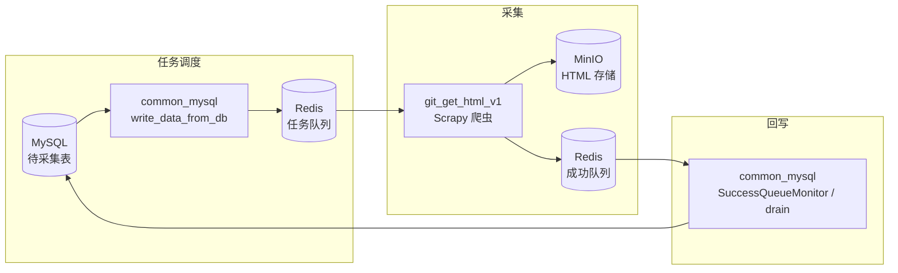

# crawler_collect_tools_set

面向软件包生态（GitHub、npm、PyPI、Go、NuGet、Maven 等）的 **HTML 页面采集与任务调度工具集**。从 MySQL 读取待采集任务，经 Redis 队列分发给 Scrapy 爬虫，将页面 HTML 写入 MinIO，并回写 MySQL 完成状态。

---

## 整体架构



典型链路：

1. **推任务**：`tools/common_mysql/write_data_from_db.py` 从 MySQL 游标读取 `is_finish=0` 记录，写入 Redis 任务队列（如 `go_html:urls`）。
2. **爬取**：`git_get_html_v1` 中的 Scrapy 爬虫消费队列，下载页面 HTML，上传 MinIO，并将 purl/URL 推入成功队列。
3. **回写**：成功队列中的 ID 批量 UPDATE 回 MySQL（全流程内嵌监控，或由 `drain_success_queue_to_mysql.py` 独立清积压）。

---

## 仓库结构

```
crawler_collect_tools_set/
├── git_get_html_v1/          # 主 Scrapy 项目（多源 HTML 爬虫）
├── tools/
│   ├── common_mysql/         # MySQL 客户端 + MySQL↔Redis 流式任务（推荐）
│   ├── common_minio/         # MinIO 上传工具
│   ├── common_logger/        # 统一日志
│   ├── key_token_config/     # 代理 / Redis / MySQL / MinIO 密钥配置
│   ├── utils/                # 辅助脚本
│   └── write_data_to_redis_by_DB/  # 旧版任务调度（已弃用，请用 common_mysql）
├── nuget/                    # 旧版 NuGet 独立项目（已整合进 git_get_html_v1）
├── LICENSE
└── README.md
```

---

## 快速开始

### 1. 安装依赖

```bash
pip install scrapy scrapy-redis scrapy-redis-bloomfilter scrapy-impersonate curl_cffi
pip install redis aiomysql pymysql minio
pip install colorama   # 可选，Windows 控制台彩色日志
```

### 2. 配置密钥

```bash
cp tools/key_token_config/secrets.example.py tools/key_token_config/secrets.py
# 编辑 secrets.py，填写代理、Redis、MySQL、MinIO 等真实连接信息
```

`secrets.py` 已被 `.gitignore` 忽略，请勿提交到仓库。

也可通过环境变量覆盖 MySQL 连接（前缀 `MYSQL_`），详见 [tools/common_mysql/README.md](tools/common_mysql/README.md)。

### 3. 推送爬取任务（MySQL → Redis）

在仓库根目录执行：

```bash
# 使用内置 maven profile（profiles/maven.json）
python tools/common_mysql/write_data_from_db.py --platform maven

# 其他平台：复制 profiles/maven.json 为 go.json / npm.json 等并修改后
python tools/common_mysql/write_data_from_db.py --profile tools/common_mysql/profiles/go.json
```

### 4. 启动爬虫

```bash
cd git_get_html_v1
scrapy crawl go_html
# 或：scrapy crawl npm_html / pypi_html / github_html / nuget_html ...
```

### 5. 回写成功队列（可选，清积压时使用）

```bash
python tools/common_mysql/drain_success_queue_to_mysql.py --platform maven
```

> 全流程模式（步骤 3）已内嵌成功队列回写；**不要与 drain 同时运行**，避免抢队列和 MySQL 锁竞争。

---

## git_get_html_v1：HTML 爬虫

基于 **Scrapy + scrapy-redis + scrapy-impersonate（curl_cffi TLS 指纹伪装）** 的分布式爬虫项目。

| Spider | Redis 任务队列 | MinIO 桶 | 说明 |
|--------|----------------|----------|------|
| `github_html` | `github_html:urls` | `github-new` | GitHub 仓库页 |
| `npm_html` | `npm_html:urls` | `npm` | npmjs.com 包页 |
| `pypi_html` | `pypi_html:urls` | `pypi-new` | PyPI 项目页（含 Cloudflare 处理） |
| `go_html` | `go_html:urls` | `golang-2026` | pkg.go.dev 模块页 |
| `nuget_html` | `nuget_html:urls` | `nuget-new` | nuget.org 包页 |
| `gitlab_html` | `gitlab_html:urls` | — | GitLab（pipeline 待完善） |
| `gitee_html` | `gitee_html:urls` | — | Gitee（pipeline 待完善） |

任务格式支持 **purl**（如 `pkg:npm/lodash`）或站点 URL；各 spider 内有归一化逻辑。

Redis key 命名约定见 `git_get_html_v1/git_get_html_v1/utils/create_redis_key.py`（`{spider}:urls`、`{spider}:success_urls`、`{spider}:run_urls` 等）。

---

## tools 模块说明

| 模块 | 说明 | 文档 |
|------|------|------|
| **common_mysql** | MySQL 同步/异步客户端；MySQL↔Redis 流式任务；profile 驱动 CLI | [README](tools/common_mysql/README.md) |
| **common_minio** | MinIO 文件上传封装 | — |
| **common_logger** | 控制台 + 滚动文件日志 | [README](tools/common_logger/README.md) |
| **key_token_config** | 统一密钥入口（`from tools.key_token_config import PROXY_DEFAULT`） | `secrets.example.py` |
| **write_data_to_redis_by_DB** | 旧版 MySQL→Redis 脚本 | 已弃用，请迁移至 common_mysql |

### common_mysql 常用命令

```bash
# 全流程：推任务 + 回写成功队列
python tools/common_mysql/write_data_from_db.py --platform maven

# 仅消费成功队列（独立入口，不依赖 write_data_from_db.py）
python tools/common_mysql/drain_success_queue_to_mysql.py --platform maven --once

# 非 Redis 模式：只读 MySQL，自定义处理后写回
python tools/common_mysql/write_data_from_db.py --platform maven --no-redis
```

新增采集源时，在 `tools/common_mysql/profiles/` 下添加 JSON profile 即可，无需改 Python 代码。

---

## 配置要点

所有敏感配置集中在 `tools/key_token_config/secrets.py`：

| 配置项 | 用途 |
|--------|------|
| `PROXY_DEFAULT` / `PROXY_GITHUB_PYPI` / `PROXY_NUGET` | 各源 HTTP 代理 |
| `REDIS_GIT_GET_HTML` / `REDIS_GIT_GET_HTML_URL` | Scrapy 与任务队列 Redis |
| `MYSQL_*` / `MYSQL_TOOLS_DEFAULT` | 任务表与回写 MySQL |
| `MINIO_61_TEST` 等 | HTML 对象存储 |
| `GITHUB_TOKENS` | GitHub API（如需要） |

Scrapy 项目启动时会自动将仓库根目录加入 `sys.path`，可直接 `from tools.key_token_config import ...`。

---

## 开发与调试

```bash
# 查看 common_mysql 内置平台
python -c "from tools.common_mysql import list_builtin_platforms; print(list_builtin_platforms())"

# 单 spider 本地试跑（需 Redis 中已有任务）
cd git_get_html_v1 && scrapy crawl npm_html

# 日志目录（运行时生成，已 gitignore）
# app_logs/
```

---

## 迁移说明

| 旧路径 | 新路径 / 说明 |
|--------|----------------|
| `nuget/get_nuget_html/` | 已整合为 `git_get_html_v1/spiders/nuget_html.py` |
| `tools/write_data_to_redis_by_DB/write_data_from_db.py` | `tools/common_mysql/write_data_from_db.py` |
| `tools/write_data_to_redis_by_DB/drain_success_queue_to_mysql.py` | `tools/common_mysql/drain_success_queue_to_mysql.py` |

---

## License

[MIT](LICENSE) © 2026 yingyueyu
