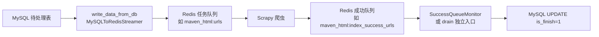

# common_mysql

通用 MySQL 工具集，包含两层能力：

1. **连接与批处理**：同步/异步客户端、连接池、事务、分块批量写入
2. **流式任务流水线**：MySQL 表 → Redis 爬虫任务队列 → 成功队列 → MySQL 回写（profile + CLI 驱动）

本模块为**自包含**实现，不依赖 `tools/write_data_to_redis_by_DB/`。

---

## 安装依赖

```bash
# 基础 MySQL 客户端
pip install pymysql aiomysql

# 流式任务（MySQL ↔ Redis 流水线）额外需要
pip install redis
```

---

## 环境变量

通过 `MySQLConfig.from_env()` 读取，默认前缀 `MYSQL_`：

| 变量 | 说明 | 默认 |
|------|------|------|
| `MYSQL_HOST` | 主机 | 见 `config.py` |
| `MYSQL_PORT` | 端口 | `3306` |
| `MYSQL_USER` | 用户名 | — |
| `MYSQL_PASSWORD` | 密码 | — |
| `MYSQL_DATABASE` | 库名 | 空（profile 可单独指定 `database_name`） |
| `MYSQL_CHARSET` | 字符集 | `utf8mb4` |
| `MYSQL_CONNECT_TIMEOUT` | 连接超时（秒） | `10` |
| `MYSQL_READ_TIMEOUT` | 读超时（秒） | `300` |
| `MYSQL_WRITE_TIMEOUT` | 写超时（秒） | `300` |
| `MYSQL_AUTOCOMMIT` | 自动提交 | `false` |
| `MYSQL_MINSIZE` / `MYSQL_MAXSIZE` | 异步池大小 | `1` / `10` |
| `MYSQL_POOL_RECYCLE` | 连接回收（秒） | `1800` |

建议在运行前通过环境变量或 `tools/key_token_config/secrets.py` 注入账号密码，勿将凭据写入代码仓库。

---

## 目录结构

```
common_mysql/
├── config.py                      # MySQLConfig 与环境变量解析
├── sync_mysql.py                  # SyncMySQLClient
├── async_mysql.py                 # AsyncMySQLClient（连接池、分块写入）
├── mysql_builder.py               # SQL 构建辅助
├── profile_loader.py              # 加载 profiles/*.json
├── stream_job_config.py           # StreamJobConfig、Redis/Writeback 配置、共享工具函数
├── success_queue.py               # 成功队列消费与 MySQL 写回
├── write_data_from_db.py          # MySQL → Redis 上传 + 全流程 CLI
├── drain_success_queue_to_mysql.py # 仅消费成功队列 CLI（独立入口）
├── profiles/                      # 内置平台 profile（如 maven.json）
├── example_usage.py               # 同步/异步客户端示例
└── mysql_table_module/            # 业务表 SQL 片段
```

---

## 一、MySQL 客户端

### 同步示例

```python
from tools.common_mysql import MySQLConfig, SyncMySQLClient

cfg = MySQLConfig.from_env()
with SyncMySQLClient(cfg) as client:
    rows = client.query_all("SELECT 1 AS num")
    print(rows)

    with client.transaction():
        client.executemany(
            "INSERT INTO demo(name) VALUES (%s)",
            [("a",), ("b",)],
        )
```

### 异步示例

```python
import asyncio
from tools.common_mysql import AsyncMySQLClient, MySQLConfig

async def main() -> None:
    cfg = MySQLConfig.from_env()
    async with AsyncMySQLClient(cfg) as client:
        one = await client.query_one("SELECT COUNT(*) AS c FROM demo")
        await client.executemany_chunked(
            "INSERT INTO demo(name) VALUES (%s)",
            [("x",), ("y",)],
            chunk_size=500,
            retries=3,
        )

asyncio.run(main())
```

大批量写入可使用 `executemany_chunked_parallel`（按块并发，需合理设置 `max_concurrency`）。

### 主要 API

| 类 / 方法 | 说明 |
|-----------|------|
| `MySQLConfig.from_env(prefix="MYSQL_")` | 从环境变量构建配置 |
| `SyncMySQLClient` | `connect` / `close` / `execute` / `query_one` / `query_all` / `executemany` / `transaction` |
| `AsyncMySQLClient` | 同上（异步）+ `executemany_chunked` / `executemany_chunked_parallel` |

游标默认返回字典行（`DictCursor`），可通过 `use_dict_cursor=False` 关闭。

---

## 二、流式任务流水线

适用于爬虫任务分发场景：从 MySQL 读取 `is_finish=0` 的记录，推入 Redis 任务队列；爬虫完成后写入成功队列；再批量 UPDATE MySQL 标记完成。



### 两种运行模式

| 模式 | 入口 | 作用 |
|------|------|------|
| **全流程** | `write_data_from_db.py` | MySQL 推任务队列 + 并行消费成功队列回写 |
| **仅清成功队列** | `drain_success_queue_to_mysql.py` | 只消费成功队列积压，不推新任务 |

> **注意**：全流程与 drain **不要同时跑**，否则会抢同一成功队列并可能造成 MySQL 锁竞争。

---

## 三、Profile 配置

任务参数通过 `profiles/*.json` 定义。内置平台放在 `profiles/` 下，文件名即 `--platform` 的值（如 `maven.json` → `--platform maven`）。

### 必填字段

| 字段 | 说明 |
|------|------|
| `platform_key` | 平台标识 |
| `database_name` | MySQL 库名 |
| `table_name` | 源表名 |
| `columns` | SELECT 字段，如 `purl` 或 `purl, repo_id` |

### 常用可选字段

| 字段 | 说明 | 默认 |
|------|------|------|
| `conditions` | WHERE 条件，如 `is_finish = 0` | 无 |
| `cursor_field` | 游标分页字段 | 自动推断 |
| `use_redis` | 是否走 Redis 模式 | `true` |
| `redis.queue_key` | 任务队列 key | — |
| `redis.success_queue_key` | 成功队列 key | — |
| `upload_format` | Redis 上传格式（见下） | `text` |
| `writeback` | MySQL 回写字段配置 | 见 maven 示例 |
| `batch_size` | 批次大小 | `1000` |
| `monitor_interval` | 队列监控间隔（秒） | `2` |
| `threshold_ratio` | 任务队列背压阈值比例 | `0.2` |
| `success_queue_stable_seconds` | 上传结束后成功队列稳定等待秒数 | `30` |

### Redis 上传格式 `upload_format`

**单列文本**（go / npm / github 等）：

```json
{ "type": "text", "field": "purl_name" }
```

**多字段 JSON**（maven 等）：

```json
{ "type": "dict", "field": ["purl", "repo_id"] }
```

### 写回配置 `writeback`

```json
{
  "id_field": "purl",
  "pending_condition": "is_finish = 0",
  "update_fields": {
    "is_finish": 1,
    "updated_time": "NOW()"
  }
}
```

### 示例：`profiles/maven.json`

参见仓库内 `profiles/maven.json`，包含 maven 任务队列、成功队列、dict 上传格式及写回配置。

### 新增平台

复制 `profiles/maven.json` 为 `profiles/go.json`（或其他名称），修改表名、Redis key、字段即可，无需改 Python 代码。

---

## 四、命令行用法

### 全流程：MySQL → Redis → 回写

```bash
# 内置 maven profile
python tools/common_mysql/write_data_from_db.py --platform maven

# 自定义 profile
python tools/common_mysql/write_data_from_db.py --profile path/to/custom.json

# 覆盖部分参数
python tools/common_mysql/write_data_from_db.py --platform maven --batch-size 500

# 非 Redis 模式：只读 MySQL，由回调处理后再写回
python tools/common_mysql/write_data_from_db.py --platform maven --no-redis
```

常用覆盖参数：`--database`、`--table`、`--columns`、`--queue-key`、`--success-queue-key`、`--batch-size`、`--threshold-ratio`。

### 独立 drain：仅消费成功队列

```bash
# 持续消费（默认轮询等待新数据）
python tools/common_mysql/drain_success_queue_to_mysql.py --platform maven

# 试跑一批
python tools/common_mysql/drain_success_queue_to_mysql.py --platform maven --once

# 队列清空后退出
python tools/common_mysql/drain_success_queue_to_mysql.py --platform maven --stop-when-empty

# 调小批次，减轻 MySQL 锁等待
python tools/common_mysql/drain_success_queue_to_mysql.py --platform maven \
  --batch-size 500 --update-chunk-size 100
```

drain 专用参数：`--update-chunk-size`、`--update-max-retries`、`--once`、`--max-batches`、`--stop-when-empty`、`--no-drain-partial`。

---

## 五、编程式调用

### 加载 profile 并跑全流程

```python
import asyncio
from tools.common_mysql import build_stream_job_config, load_profile_data, run_stream_job

job = build_stream_job_config(load_profile_data("maven"))
asyncio.run(run_stream_job(job))
```

### 仅消费成功队列

```python
import asyncio
from tools.common_mysql import build_stream_job_config, load_profile_data, run_drain_success_queue

job = build_stream_job_config(load_profile_data("maven"))
asyncio.run(run_drain_success_queue(job, stop_when_empty=True))
```

### 非 Redis：读取 + 外部处理 + 写回

```python
import asyncio
from tools.common_mysql import (
    MysqlWritebackClient,
    build_stream_job_config,
    load_profile_data,
    run_non_redis_pipeline,
)

async def my_process_batch(rows, writeback, job):
    success_ids = []
    for row in rows:
        # 替换为真实外部处理逻辑
        if row.get(job.writeback.id_field):
            success_ids.append(str(row[job.writeback.id_field]))
    if success_ids:
        await writeback.writeback(job.table, success_ids)

job = build_stream_job_config(load_profile_data("maven"))
asyncio.run(run_non_redis_pipeline(job, my_process_batch))
```

### 直接使用底层类

```python
from tools.common_mysql import (
    MySQLToRedisStreamer,
    SuccessQueueMonitor,
    SuccessQueueDrainer,
    MysqlTableReader,
    MysqlWritebackClient,
    StreamJobConfig,
)
```

| 类 / 函数 | 说明 |
|-----------|------|
| `MySQLToRedisStreamer` | MySQL 游标分页 → Redis 任务队列 |
| `SuccessQueueMonitor` | 成功队列 → MySQL 写回（全流程内嵌） |
| `SuccessQueueDrainer` | 成功队列专用回写器（支持尾批、失败重试） |
| `run_drain_success_queue` | drain 异步入口 |
| `MysqlTableReader` | 非 Redis 模式：只读游标分页 |
| `MysqlWritebackClient` | 独立 MySQL 写回（支持 CASE WHEN 多列更新） |
| `run_stream_job` | Redis 全流程入口 |
| `run_non_redis_pipeline` | 非 Redis 流水线入口 |

配置 dataclass：`StreamJobConfig`、`RedisSettings`、`UploadFormatConfig`、`WritebackConfig`（定义于 `stream_job_config.py`）。

---

## 六、模块依赖关系

```
drain_success_queue_to_mysql.py
    ├── stream_job_config.py
    ├── success_queue.py
    └── profile_loader.py

write_data_from_db.py
    ├── stream_job_config.py
    ├── success_queue.py   （仅 SuccessQueueMonitor）
    └── profile_loader.py
```

`drain_success_queue_to_mysql.py` **不 import** `write_data_from_db.py`，可单独部署使用。

---

## 本地验证

```bash
# MySQL 客户端示例（需配置 MYSQL_*）
python tools/common_mysql/example_usage.py

# 查看内置平台
python -c "from tools.common_mysql import list_builtin_platforms; print(list_builtin_platforms())"

# CLI 帮助
python tools/common_mysql/write_data_from_db.py --help
python tools/common_mysql/drain_success_queue_to_mysql.py --help
```

---
